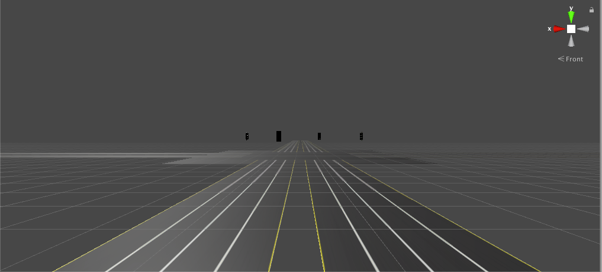

## Introduction
This is a test map for lgsvl, which has 4 lanes and a junction. You can use this map to construct complex test scenarios such as lane change, overtaking, traffic lights, and more. Compared to single lane, this map can achieve more diverse functions.  
   

## QuickStart
You can download the source code and compile the map yourself.  
1. git clone the repository and put it into "simulator/asset/external/environment"  
2. Compile the code using the menu "Simulator/Build"  

You can also download the build version from the Baidu network disk. [Link](https://pan.baidu.com/s/1c3S8NHhUGkv-J9gj_WlHaQ). Extraction code(4vwt).  

## Questions
If you have any question, pls feel free to tell us.  

